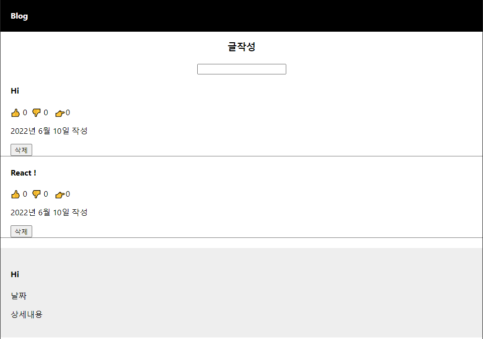

# React Blog Project

- ### 프로젝트 목표

  - React의 기초를 다지는데 중점.
  - State의 사용, jsx에 대한 이해, JavaScript문법에 대한 이해  

- ### 목표기능

  - C R D 구현
  - Detail을 Modal로 구현
  - 좋아요, 싫어요 기능 구현

- ### 느낀점

  - 매우 간단한 프로젝트였지만 전에 사용하던 Vue와는 다른 부분이 많아 처음에 약간 고생했다.
  - State에 대한 이해가 생겼고, Props를 통해 데이터의 전달 또한 진행했다.
  - Components들을 분리하지 않고 하나의 jsx파일에서 진행해서 코드가 지저분해졌지만 다음에 진행해 볼 프로젝트에선 Components들의 분리를 통해 더 가독성이 좋은 코드를 만들어야겠다. 
